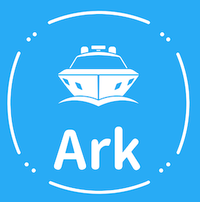
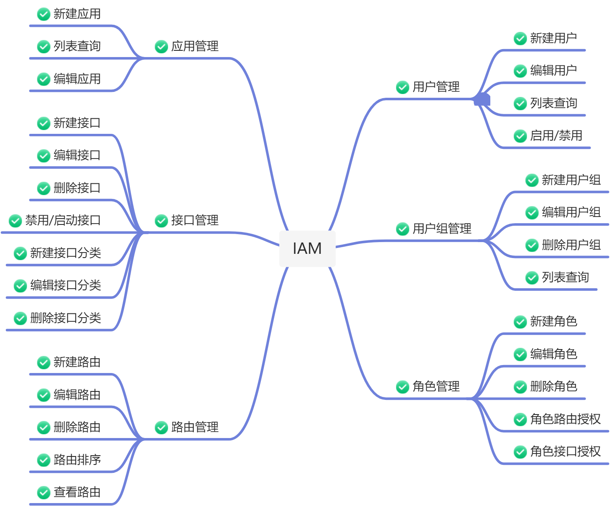

  

  <h2>Ark-Center-Iam</h2>

  
  
  

## 项目简介

`ark-center-iam` 项目是`ark-center`系列的用户中心，该项目集合了领域驱动设计（Domain-Driven Design, DDD）、COLA和六边形架构（Hexagonal Architecture）进行构建，借鉴DDD对于领域模型的提炼及划分；同时使用COLA、六边形架构进行落地真实的企业级微服务架构项目。

## 主要特点
- **COLA+六边形架构**：使用COLA+六边形架构进行真正的代码工程落地
- **微服务**：教你解决微服务实际的难点，包括但不限于高并发、海量数据、缓存、限流、安全等。
- **前后端分离**：提升用户体验以及开发体验，学习最前沿的开发模式
- **容器化部署**：使用Docker/PodMan进行打包构建
- **最前沿的版本**：使用SpringBoot 3.x、JDK21、Vue3进行开发

## 功能清单

[//]: # ()
[//]: # (| 项目名称                 | 仓库地址                                                                                                                                                                        | 备注                                                              |)

[//]: # (|:---------------------|-----------------------------------------------------------------------------------------------------------------------------------------------------------------------------|-----------------------------------------------------------------|)

[//]: # (| newbee-mall          | [newbee-mall in GitHub]&#40;https://github.com/newbee-ltd/newbee-mall&#41; [newbee-mall in Gitee]&#40;https://gitee.com/newbee-ltd/newbee-mall&#41;                                      | 初始版本、Spring Boot、Thymeleaf、MyBatis、MySQL                        |)

[//]: # (| newbee-mall-plus     | [newbee-mall-plus in GitHub]&#40;https://github.com/newbee-ltd/newbee-mall-plus&#41; [newbee-mall-plus in Gitee]&#40;https://gitee.com/newbee-ltd/newbee-mall-plus&#41;                 | 升级版本、优惠券、秒杀、支付、Spring Boot、Thymeleaf、MyBatis、MySQL、Redis        |)

[//]: # (| ark-center-iam    | [ark-center-iam in GitHub]&#40;https://github.com/newbee-ltd/ark-center-iam&#41; [ark-center-iam in Gitee]&#40;https://gitee.com/newbee-ltd/ark-center-iam&#41;             | 微服务版本、分布式事务、Spring Cloud Alibaba、Nacos、Sentinel、OpenFeign、Seata |)

[//]: # (| newbee-mall-api      | [newbee-mall-api in GitHub]&#40;https://github.com/newbee-ltd/newbee-mall-api&#41; [newbee-mall-api in Gitee]&#40;https://gitee.com/newbee-ltd/newbee-mall-api&#41;                     | 前后端分离、Spring Boot、MyBatis、Swagger、MySQL                         |)

[//]: # (| newbee-mall-api-go   | [newbee-mall-api-go in GitHub]&#40;https://github.com/newbee-ltd/newbee-mall-api-go&#41; [newbee-mall-api-go in Gitee]&#40;https://gitee.com/newbee-ltd/newbee-mall-api-go&#41;         | 前后端分离、Go、Gin、MySQL                                              |)

[//]: # (| newbee-mall-vue-app  | [newbee-mall-vue-app in GitHub]&#40;https://github.com/newbee-ltd/newbee-mall-vue-app&#41; [newbee-mall-vue-app in Gitee]&#40;https://gitee.com/newbee-ltd/newbee-mall-vue-app&#41;     | 前后端分离、Vue2、Vant                                                 |)

[//]: # (| newbee-mall-vue3-app | [newbee-mall-vue3-app in GitHub]&#40;https://github.com/newbee-ltd/newbee-mall-vue3-app&#41; [newbee-mall-vue3-app in Gitee]&#40;https://gitee.com/newbee-ltd/newbee-mall-vue3-app&#41; | 前后端分离、Vue3、Vue-Router4、Pinia、Vant4                              |)

[//]: # (| vue3-admin           | [vue3-admin in GitHub]&#40;https://github.com/newbee-ltd/vue3-admin&#41; [vue3-admin in Gitee]&#40;https://gitee.com/newbee-ltd/vue3-admin&#41;                                         | 前后端分离、Vue3、Element-Plus、Vue-Router4、Vite                        |)

## 技术选型

### 基础开发框架版本

|        后端开发框架        |     版本     |
|:--------------------:|:----------:|
|         JDK          |     21     |
|     Spring Boot      |   3.2.1    |
|     Spring Cloud     |  2023.0.0  |
| Spring Cloud Alibaba | 2022.0.0.0 |

### 微服务组件技术选型

|    技术     |             组件实现              |   版本   | 备注  |
|:---------:|:-----------------------------:|:------:|:---:|
| 服务注册与服务发现 |             Nacos             | 2.2.1  | 已整合 |
|   配置中心    |             Nacos             | 2.2.1  | 已整合 |
|   服务通信    |          Open Feign           | 3.1.1  | 已整合 |
|   负载均衡器   |   Spring Cloud Loadbalancer   | 3.1.1  | 已整合 |
|   服务网关    |     Spring Cloud Gateway      | 3.1.1  | 已整合 |
|    断路器    |           Sentinel            | 1.8.4  | 已整合 |
|   链路追踪    |  Spring Cloud Sleuth、Zipkin   | 3.1.1  | 已整合 |
|   分布式事务   |             Seata             | 1.4.2  | 已整合 |
|   日志中心    | ElasticSearch、Logstash、Kibana | 7.17.8 | 已整合 |

## 架构图简版

## 联系作者

**如果各位看官觉得学习该项目能有所收获，也可以给项目一个 Star，我会持续更新，谢谢各位的支持。**

> 大家有任何问题或者建议都可以在 [issues](https://github.com/javisChen/ark-center-iam/issues) 中反馈给我，我会慢慢完善这个项目。

- 我的邮箱：812106872@qq.com

> ark-center-iam 在 GitHub 和国内的码云都创建了代码仓库，如果有人访问 GitHub 比较慢的话，建议在 Gitee
> 上查看该项目，两个仓库会保持同步更新。

- [ark-center-iam in GitHub](https://github.com/javisChen/ark-center-iam/issues)

## 参考资料

- [COLA 4.0](https://blog.csdn.net/significantfrank/article/details/110934799)
- [跨越DDD从理论到工程落地的鸿沟](https://blog.csdn.net/significantfrank/article/details/123267395?spm=1001.2014.3001.5502)
- [spring-projects](https://github.com/spring-projects/spring-boot)
- [spring-cloud](https://github.com/spring-cloud)
- [spring-cloud-alibaba](https://github.com/alibaba/spring-cloud-alibaba)
- [alibaba](https://github.com/alibaba)
- [elasticsearch](https://github.com/elastic/elasticsearch)
- [mybatis](https://github.com/mybatis/mybatis-3)
- [projectlombok](https://github.com/projectlombok/lombok)
- [swagger-api](https://github.com/swagger-api)
